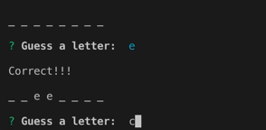
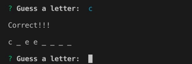
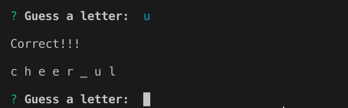
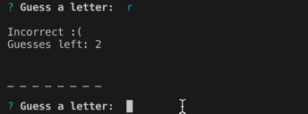

# Constructor-Word-Guess
This application is a Word Guess game created using inquirer and constructors in JavaScript. Word and Letter objects are defined using constructors, with methods to aid in gameplay.

## Gameplay
Upon game load, a term is randomly selected from a word bank, which, in this case, is an assortme nt of synonyms for the word "happy." The console will then display a series of blanks that represents each letter of the chosen word, and the user will be prompted (by inquirer) to guess a letter. 

Once the user enters a letter, if the letter is present in the chosen word, each corresponding blank that holds the guessed letter will be filled in with the letter.  

Otherwise, the letter is not present, the blanks will remain the same, and the user's number of guesses left will be decremented. 

The game will continue on guessing different letters until they either finish the word, or run out of guesses. If the user successfully completes the word and the whole word is displayed with no blanks, they have won the game and will be prompted to play again. 

If the user runs out of guesses (i.e. "guesses left" is equal to 0), they lose the game, and will be prompted to play again. 

If the user chooses to play again, their number of guesses left will be reset to 10, a new word from the word bank will be chosen, and they will be able to guess the new word.

